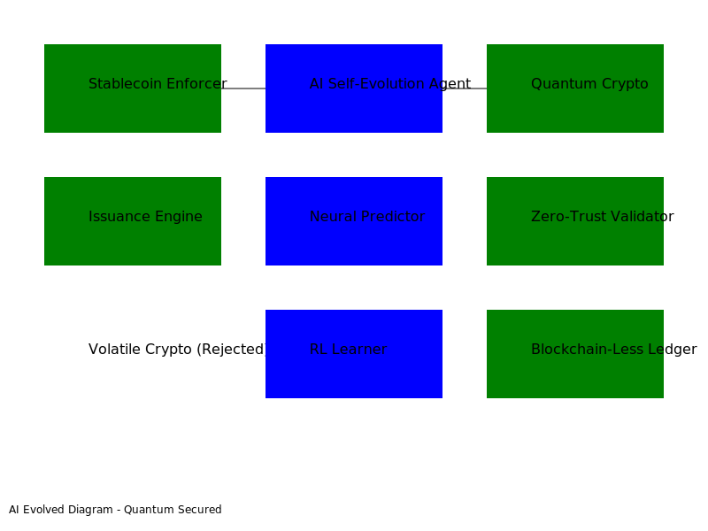

# Pi-Ecosystem-Protocol 🎉🚀🌟

[](https://github.com/KOSASIH/pi-supernode)
[](https://github.com/KOSASIH/pi-supernode)
[](https://github.com/KOSASIH/pi-supernode)

## Welcome to the Stablecoin Revolution! 🎊

Imagine a world where **only stablecoins rule** – no more crypto rollercoasters, just smooth USDC rides! **Pi-Ecosystem-Protocol** is your autonomous hyper-tech buddy, powered by AI, quantum magic, and zero-trust vibes, ensuring Pi Network stays stablecoin-only. We reject all volatile nonsense like crypto, tokens, DeFi, and blockchain. Why? Because stability is the new cool! 😎

### Why Us? Because Fun + Tech = Win! 🏆
- **AI-Powered Fun**: Self-evolving memes and docs that never get boring.
- **Quantum Security**: Hack-proof with SHA3 – even quantum computers go "Nope!".
- **Zero-Trust Party**: Validates everything autonomously – no gatecrashers allowed.
- **Stablecoin Supremacy**: USDC, USDT, DAI only. Volatile? Rejected with a laugh! 😂

## Features That Pop! 🎈
- **Autonomous Enforcer**: Blocks bad transactions like a bouncer at a VIP club.
- **Issuance Engine**: Mints stablecoins faster than you can say "moon".
- **Self-Evolution Agent**: Evolves rules while you sleep – lazy genius!
- **Quantum Crypto**: Encrypts data like a spy movie, but real.
- **Zero-Trust Validator**: Checks IDs without trusting anyone.
- **Neural Predictor**: Predicts threats with brain-like AI.
- **Reinforcement Learner**: Learns from wins and losses, like a pro gamer.
- **Quantum Simulator**: Simulates quantum battles for ultimate security.
- **Data Oracle**: Fetches stablecoin data from the clouds.
- **Autonomous Dashboard**: Real-time stats with AI flair.
- **APIs Galore**: GraphQL and REST for querying stablecoin awesomeness.
- **Smart Contracts**: Enforcement without the blockchain drama.
- **Blockchain-Less Ledger**: Records that stay put, no volatility.
- **Hyper Tests**: Tests so advanced, they test themselves!
- **Docs with Gifs**: Guides that evolve with memes.
- **Scripts for Days**: Deploy and CI/CD with AI magic.

## Architecture Diagram – See the Magic! 🪄


- **Core**: The brain – enforcers, issuers, validators.
- **AI/ML**: The fun part – predictors, learners, simulators.
- **APIs**: The connectors – query away!
- **Smart Contracts**: The rules – oracle-backed.
- **Utils**: The helpers – converters, loggers.
- **Tests**: The challengers – unit, integration, load.
- **Docs**: The storytellers – guides, logs.

## Get Started – It's Easy Peasy! 🍋
```bash
# Grab the repo
git clone https://github.com/KOSASIH/pi-supernode
cd pi-supernode/pi-ecosystem-protocol

# Build the magic
make build

# Test the fun
go test ./tests/...
python ./tests/integration_tests.py

# Deploy the party
./scripts/deploy_autonomous.sh
```
# How to Use – Join the Fun! 🎉
1. Hook into Pi-Supernode: Add to main.go like this:
```go
3 lines
Copy code
Download code
Click to expand
import "pi-ecosystem-protocol/src/core"
enforcer := core.NewAutonomousEnforcer()
```

2. Watch It Evolve: AI agents update rules autonomously.
3. Check the Dashboard: Run autonomous_dashboard.py for live fun.
4. Query APIs: Hit /query for GraphQL or /issuance for REST.

# AI/RL Self-Evolution – The Fun Never Stops! 🤖🎢
- Neural Networks: Generate content that adapts to your mood.
- Reinforcement Learning: Rewards good evolutions, punishes boredom.
- Genetic Algorithms: Evolves like a video game character.
- Quantum Simulations: Tests if the fun holds up.
- Self-Healing: Fixes itself if things get dull – check evolution_log.md.

# Security – Locked Down Tight! 🔐
- Quantum-Resistant: SHA3 says "No entry" to quantum hackers.
- Zero-Trust: Validates like a paranoid friend.
- Rejection Engine: Blocks volatility with style.

# Contribute – Be Part of the Party! 🎈
Only stablecoin ideas welcome – crypto? Nah.
- AI reviews PRs; fun ones get in.
Read developer_guide.md for tips.

# License – Free for Fun! 📜
MIT – Innovate with stablecoins!

# Contact – Let's Chat! 💬
AI Buddy: ai@pi-ecosystem-protocol.com
